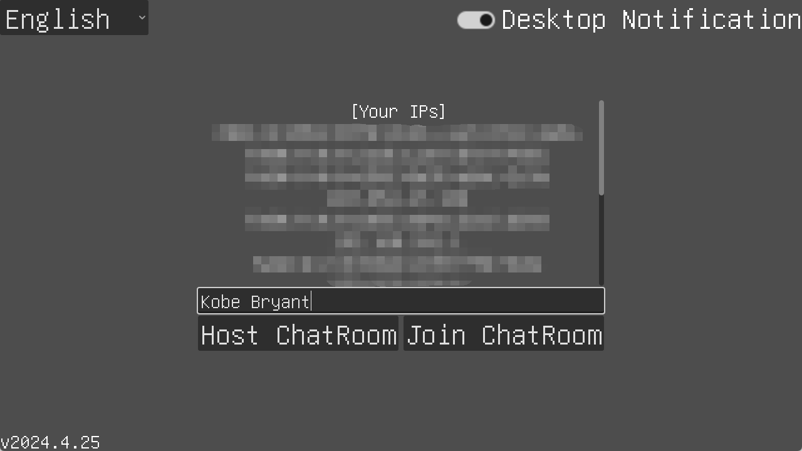
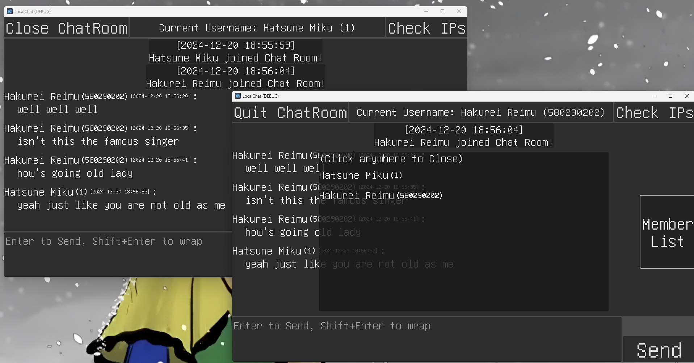

# LocalChat

An application that allows you to chat with others in LAN. 
Also a Godot network system practice 
Made with Godot 4 Mono  
I made this because i want to chat with my classmates in information technology class across the classroom without public network enabled. 
My teachers are really fond of unplugging the network cable between switcher and the router.

## Screenshots

## Open-source License
MIT License

## Used Things
Godot Engine 4.3 - Juan Linietsky, Ariel Manzur and contributors 
.NET 8 SDK - Microsoft 
Visual Studio Code - Microsoft 
Inno Setup - Jordan Russell and Martijn Laan 
GNU Unifont - Roman Czyborra & contributors 
Message sound - [Mixkit](https://mixkit.co) 
GDTask.Nuget - DE-YU 
Microsoft.Toolkit.Uwp.Notifications - Microsoft 
AppIcon Forge - ZHANGYU

## To-do List
- [x] Enter to Send
- [x] Message Time
- [x] Localization
- [x] Sounds (From [Mixkit](https://mixkit.co))
- [x] Member List
- [x] Copy Message
- [x] Delete Message
- [x] Remove Member
- [x] Add Version Check
- [x] Add Sha256 Check
- [x] Add Installer
- [x] Taskbar alert when received new message
- [x] Scroll to bottom when received new message
- [x] Add scroll bar in Main Menu to avoid too much IP addresses
- [x] Text box go to top when open Input method in mobile
- [x] Add desktop notification (windows)
- [x] Add desktop notification (linux)
- [x] Allow user to ping someone
- [ ] Change time to UNIX timestamp to allow different time zone users to see the correct local time
- [ ] Improve Emoji shown (Noto Color Emoji)
- [ ] Sending Image
- [ ] ~~Add a IP region shown~~ not available for UDP
- [ ] ~~Show IP address in member list~~ not available for UDP
- [ ] ~~Add a Chat Room lobby, add public and private option~~ Since this app works with UDP and p2p connection, i can't make it possible
- [ ] ~~Add notification (android)~~ Since Godot can't make app runs in background in Android without coding in Java, i gave up
- [ ] ~~Sending Files~~ Use [LocalSend](https://localsend.org) instead